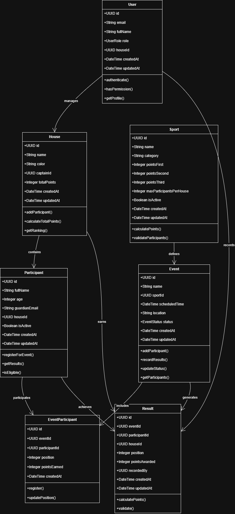

# Chapter 3: System Implementation

## 3.1 Introduction

This chapter presents the detailed implementation of the Sports Day Management System, covering the tools and technologies used, database design, development methodology, and system architecture. The system was developed as a comprehensive web application to streamline the management of school sports events, participant registration, and real-time results tracking.

## 3.2 Tools and Technologies Used

### 3.2.1 Frontend Technologies

**Next.js 15 (App Router)**
- Modern React framework with server-side rendering capabilities
- App Router for improved routing and layout management
- Built-in optimization for performance and SEO
- TypeScript support for type safety

**React 18**
- Component-based user interface development
- Hooks for state management and side effects
- Server and client components for optimal performance

**Tailwind CSS v4**
- Utility-first CSS framework for rapid UI development
- Custom design system with consistent spacing and colors
- Responsive design capabilities
- Dark mode support

**shadcn/ui Component Library**
- Pre-built, accessible UI components
- Consistent design language across the application
- Customizable component variants
- Built on Radix UI primitives

**Lucide React Icons**
- Comprehensive icon library
- Consistent visual language
- Scalable vector icons
- Tree-shakable for optimal bundle size

### 3.2.2 Backend Technologies

**Supabase**
- Backend-as-a-Service (BaaS) platform
- PostgreSQL database with real-time capabilities
- Built-in authentication and authorization
- Row Level Security (RLS) for data protection
- RESTful API with automatic generation

**PostgreSQL**
- Relational database management system
- ACID compliance for data integrity
- Advanced querying capabilities
- JSON support for flexible data structures

### 3.2.3 Development Tools

**TypeScript**
- Static type checking for JavaScript
- Enhanced IDE support and autocomplete
- Reduced runtime errors
- Better code documentation

**ESLint & Prettier**
- Code quality and formatting tools
- Consistent code style across the project
- Automated error detection

**Git Version Control**
- Source code management
- Collaborative development support
- Change tracking and history

**Vercel Platform**
- Deployment and hosting platform
- Automatic deployments from Git
- Edge network for global performance
- Environment variable management

### 3.2.4 Authentication & Security

**Supabase Auth**
- Email/password authentication
- Session management
- Role-based access control
- Secure token handling

**Middleware Protection**
- Route-level authentication
- Automatic redirects for unauthorized access
- Session validation

## 3.3 Database Design

### 3.3.1 Database Schema Overview

The system uses a relational database design with seven main entities, each serving specific functions within the sports management ecosystem.

### 3.3.2 Entity Relationship Diagram

### 3.3.3 Table Specifications

**PROFILES Table**
- Stores user account information and roles
- Links users to houses for house captains
- Supports role-based access control (admin, house_captain, parent)

**HOUSES Table**
- Represents competing teams in the sports day
- Tracks total points accumulated
- Maintains house colors and captain assignments

**PARTICIPANTS Table**
- Individual competitors in the sports day
- Links to houses for team affiliation
- Stores age for category-based competitions

**SPORTS Table**
- Defines available sports and their point systems
- Configurable points for different positions
- Limits participants per house per sport

**EVENTS Table**
- Scheduled competitions for specific sports
- Tracks event status (scheduled, in-progress, completed)
- Links to sports for rules and point systems

**EVENT_PARTICIPANTS Table**
- Junction table for event participation
- Records participant positions and points earned
- Enables many-to-many relationship between events and participants

**RESULTS Table**
- Final recorded results for completed events
- Tracks points awarded to houses
- Maintains audit trail with recorded_by field

### 3.3.4 Database Constraints and Relationships

**Primary Keys**
- All tables use UUID primary keys for global uniqueness
- UUIDs provide security through unpredictability

**Foreign Key Relationships**
- Participants belong to houses (participants.house_id → houses.id)
- Events are based on sports (events.sport_id → sports.id)
- Results link events, participants, and houses
- Profiles can be linked to houses for captains

**Data Integrity Constraints**
- NOT NULL constraints on essential fields
- CHECK constraints for valid status values
- UNIQUE constraints where appropriate

## 3.4 Development Methodology

### 3.4.1 Agile Development Approach

The project followed an Agile development methodology with iterative development cycles and continuous improvement.

**Sprint Planning**
- 1-week sprint cycles
- Feature-based sprint goals
- User story prioritization
- Backlog refinement sessions

**Development Practices**
- Test-driven development for critical functions
- Code reviews for quality assurance
- Continuous integration and deployment
- Regular refactoring for code quality

**Stakeholder Engagement**
- Regular demo sessions
- Feedback incorporation
- User acceptance testing
- Iterative requirement refinement

### 3.4.2 Development Phases

**Phase 1: Foundation Setup**
- Project initialization and configuration
- Database schema design and implementation
- Authentication system setup
- Basic UI component library integration

**Phase 2: Core Functionality**
- User management and role-based access
- House and participant management
- Sports and event creation
- Basic CRUD operations

**Phase 3: Advanced Features**
- Results recording and point calculation
- Real-time leaderboards and statistics
- Search and filtering capabilities
- Public viewing interfaces

**Phase 4: Polish and Optimization**
- UI/UX improvements
- Performance optimization
- Security hardening
- Documentation completion

## 3.5 System Architecture

### 3.5.1 Architecture Overview

The system follows a modern three-tier architecture with clear separation of concerns:

**Presentation Layer (Frontend)**
- Next.js React application
- Server-side rendering for performance
- Responsive design for multiple devices
- Component-based architecture

**Application Layer (Backend Logic)**
- Next.js API routes and Server Actions
- Business logic implementation
- Authentication and authorization
- Data validation and processing

**Data Layer (Database)**
- Supabase PostgreSQL database
- Row Level Security for data protection
- Real-time subscriptions
- Automated backups and scaling

### 3.5.2 Component Architecture Diagram

## 3.6 System Workflows

### 3.6.1 User Authentication Flow

### 3.6.2 Event Management Activity Diagram

### 3.6.3 Results Recording Sequence Diagram

### 3.6.4 Class Diagram

## 3.7 Security Implementation

### 3.7.1 Authentication Security

**Session Management**
- JWT tokens with automatic refresh
- Secure HTTP-only cookies
- Session timeout handling
- Multi-device session support

**Password Security**
- Bcrypt hashing with salt
- Minimum password requirements
- Account lockout after failed attempts
- Password reset functionality

### 3.7.2 Authorization Framework

**Role-Based Access Control (RBAC)**
- Admin: Full system access
- House Captain: Limited house management
- Parent: Read-only public access

**Route Protection**
- Middleware-based authentication
- Role-based route restrictions
- Automatic redirects for unauthorized access

### 3.7.3 Data Security

**Row Level Security (RLS)**
- Database-level access control
- User-specific data filtering
- Automatic policy enforcement

**Input Validation**
- Server-side validation for all inputs
- SQL injection prevention
- XSS protection through sanitization

## 3.8 Performance Optimization

### 3.8.1 Frontend Optimization

**Code Splitting**
- Route-based code splitting
- Component lazy loading
- Dynamic imports for large components

**Caching Strategy**
- Browser caching for static assets
- API response caching
- Image optimization and lazy loading

### 3.8.2 Database Optimization

**Query Optimization**
- Indexed columns for frequent queries
- Efficient JOIN operations
- Pagination for large datasets

**Real-time Performance**
- Selective real-time subscriptions
- Optimized payload sizes
- Connection pooling

## 3.9 Testing Strategy

### 3.9.1 Testing Levels

**Unit Testing**
- Component testing with React Testing Library
- Function testing for business logic
- Database query testing

**Integration Testing**
- API endpoint testing
- Database integration testing
- Authentication flow testing

**End-to-End Testing**
- User workflow testing
- Cross-browser compatibility
- Mobile responsiveness testing

### 3.9.2 Quality Assurance

**Code Quality**
- TypeScript for type safety
- ESLint for code standards
- Prettier for consistent formatting

**Performance Testing**
- Load testing for concurrent users
- Database performance monitoring
- Frontend performance metrics

## 3.10 Deployment and DevOps

### 3.10.1 Deployment Pipeline

**Continuous Integration**
- Automated testing on code commits
- Build verification and optimization
- Security vulnerability scanning

**Continuous Deployment**
- Automatic deployment to staging
- Manual promotion to production
- Rollback capabilities

### 3.10.2 Infrastructure

**Hosting Platform**
- Vercel for frontend hosting
- Global CDN for performance
- Automatic scaling based on traffic

**Database Hosting**
- Supabase managed PostgreSQL
- Automatic backups and recovery
- High availability configuration

## 3.11 Monitoring and Maintenance

### 3.11.1 Application Monitoring

**Performance Monitoring**
- Real-time performance metrics
- Error tracking and alerting
- User experience monitoring

**Security Monitoring**
- Authentication attempt logging
- Suspicious activity detection
- Regular security audits

### 3.11.2 Maintenance Procedures

**Regular Updates**
- Dependency updates and security patches
- Database maintenance and optimization
- Performance tuning and optimization

**Backup and Recovery**
- Automated daily database backups
- Point-in-time recovery capabilities
- Disaster recovery procedures

## 3.12 Conclusion

The Sports Day Management System has been successfully implemented using modern web technologies and best practices. The system provides a comprehensive solution for managing school sports events with robust security, real-time capabilities, and an intuitive user interface. The Agile development methodology ensured iterative improvement and stakeholder satisfaction throughout the development process.

The architecture supports scalability and maintainability, while the security implementation ensures data protection and user privacy. The system is ready for production deployment and can handle the demands of a full-scale sports day event with multiple concurrent users and real-time data updates.

---

*This document represents the technical implementation details of the Sports Day Management System as of the completion of development Phase 4.*
